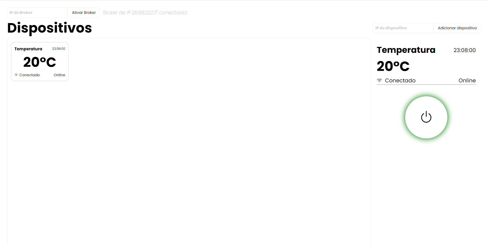

<div align="center">
<h1>TEC502 - Sistema IoT</h1>
</div>

A Internet das Coisas (IoT) permite a integração de dispositivos diversos, conectando elementos que vão desde a vida cotidiana até sistemas complexos empresariais. Entretanto, o gerenciamento de dispositivos IoT não é uma tarefa simples, pois envolve desafios de concorrência e conectividade. Este trabalho apresenta um sistema que facilita a comunicação entre diversos dispositivo e aplicações que necessitam de seus dados. O sistema permite a adição e manipulação de dispositivos de maneira eficiente a partir de uma interface remota, utilizando  *Sockets*, *frameworks* para criação de API REST e *threads*.

Para que o projeto funcione corretamente, fez-se necessário utilizar determinados protocolos de comunicação, como UDP, TCP/IP e HTTP. A partir desses protocolos é possível estabelecer uma comunicação coerente e eficiente entre os elementos do sistema, como a interface, os dispositivos e o broker. O broker é o elemento central da aplicação, pois regula as comunicações com os dispositivos e a interface remota.

O projeto foi desenvolvido a partir de ferramentas como: Java, para a criação do broker; Python, para a construção do dispositivo; React, para o desenvolvimento da interface; e Docker, para a execução dos módulos. 

### Tópicos
- [Como executar?](#como-executar)
  - [Broker](#broker)
  - [Interface](#interface)
  - [Dispositivo](#dispositivo)
- [Organização do Projeto](#organização-do-projeto)
- [Dispositivo](#dispositivo-1)
  - [Funcionamento geral](#funcionamento-geral)
  - [Arquitetura do Dispositivo](#arquitetura-do-dispositivo)
  - [Device e AirConditioner](#interface)
  - [Client](#client)
  - [Gerenciamento](#gerenciamento)
  - [Threads](#threads)
- [API](#api)
  - [Arquitetura](#arquitetura)
- [Broker](#broker)
  - [Funcionamento geral](#funcionamento-geral-1)
  - [Arquitetura](#arquitetura-1)
  - [Cadastro de dispositivos](#cadastro-de-dispositivos)
  - [Conexão inicial do dispositivo](#conexão-inicial-do-dispositivo)
  - [Validação dos Dispositivos](#validação-dos-dispositivos)
  - [Threads](#threads-1)
- [Comunicação](#comunicação)
  - [Cliente para o Broker (API)](#cliente-para-o-broker-api)
    - [Rotas](#rotas)
  - [Protocolos de comunicação - Transporte](#protocolos-de-comunicação---transporte)
    - [Broker para o dispositivo](#broker-para-o-dispositivo)
    - [Dispositivo para o broker](#dispositivo-para-o-broker)
  - [Protocolos de comunicação - Aplicação](#protocolos-de-comunicação---aplicação)
    - [Dispositivo para o broker](#dispositivo-para-o-broker-1)
    - [Broker para o dispositivo](#dispositivo-para-o-broker-1)
- [Interface gráfica](#interface-gráfica)
  - [Adicionar Broker](#adicionar-broker)
  - [Adicionar dispositivo](#adicionar-dispositivo)
  - [Adicionar Broker](#adicionar-broker)
- [Conexões simultâneas](#conexões-simultâneas)
- [Desempenho](#desempenho)
- [Confiabilidade](#confiabilidade)
  - [Dispositivo](#dispositivo-2)
  - [Broker](#broker-2)
- [Conclusão](#conclusão)


### Como executar?
Para poder manipular corretamente os dispositivos, bem como visualizar os valores gerados por eles, é necessário executar três sistemas principais, de preferência em máquinas diferentes.

Ademais, a fim de garantir que as execuções ocorram sem erros, os sistemas devem ser executados em containers docker. 

#### Broker
1. Navegue até o diretório principal.
2. Execute o comando: 
```bash
docker compose up broker –build
```

#### Interface 
1. Navegue até o diretório principal.
2. Execute o comando: 
```bash
docker compose up client –build
```
3. Acesse a aplicação em [http://localhost:3000](http://localhost:3000)

#### Dispositivo
1. Navegue até o diretório do dispositivo: 
```bash
cd Server/
```

2. Crie a imagem docker: 
```bash
docker build -t <nome_da_imagem> .
```
3. Execute o comando: 

```bash
docker container run -it -p 3002:3002 -e BROKER_IP=<ip_do_broker> -e DEVICE_NAME=<nome_do_dispositivo> <nome_da_imagem>
```

### Organização do Projeto
O projeto é dividido em 3 componentes principais:
- Dispositivo (Server)
    - Contém os arquivos referentes ao dispositivo, o qual simula um aparelho IoT real, desenvolvido em Python.
- Broker (Broker)
    - Contém os arquivos referentes ao serviço de mensageria que possibilita a troca de mensagens entre a interface gráfica e o dispositivo.
- Aplicação (Interface/iot-interface)
    - Contém os arquivos referentes à interface gráfica, a qual permite a manipulação do dispositivo pelo usuário, de maneira remota.

### Dispositivo
Os dispositivos são parte fundamental do projeto, pois geram dados que são enviados ao broker e mais tarde adquiridos pelo cliente final. Cada dispositivo pode ser manipulado por comandos advindos de um meio externo (broker) ou de uma interface local.

#### Funcionamento geral
<div align="center">
  
  <br/> <em>Figura 1. Funcionamento geral do dispositivo.</em> <br/>
</div>

#### Arquitetura do Dispositivo
Os arquivos referentes ao dispositivo são:
- `AirConditioner`: representa uma especificação do dispositivo.
- `Device`: representa o dispositivo em si.
- `Client`: lida com a comunicação, via protocolos UDP e TCP.
- `main`: arquivo principal de execução.
- `utils`: funções de auxílio.

#### Device e AirConditioner
O dispositivo em si é representado pela classe `Device`, que contém uma classe filha, a qual representa uma especificação do dispositivo, no caso, a `AirConditioner`, que diz respeito a um ar condicionado. Tais classes contam com os métodos:
- `handle_requests`: lida com comandos advindos do broker.
- `get_data`: retorna o dado “medido” pelo dispositivo.
- `get_options`: apresenta uma interface com as ações que o cliente pode realizar localmente no dispositivo, como desligar, ligar e alterar seu valor.


Ademais, essas classes contam com propriedades como:
- `name`: representa o nome do dispositivo.
- `online`: booleano que representa se o dispositivo está ligado ou desligado.
- `default_value`: valor padrão inicial medido pelo dispositivo.

#### Client
A classe `Client`, é responsável por manipular os sockets, a partir de métodos específicos:
- `send_udp_message`: envia mensagens para um destino utilizando o protocolo UDP
- `handle_tcp_connection`: cria um socket servidor para receber conexões TCP e receber dados utilizando o protocolo TCP.

Ademais, essa classe também contém atributos que guardam informações importantes, como:
- `ip`: endereço IP do broker
- `tcp_port`: porta utilizada na conexão TCP
- `udp_port`: porta utilizada no envio de dados via protocolo UDP
- `device`: classe referente ao dispositivo em si
- `isConnected`: valor booleano que indica se foi estabelecida uma conexão TCP com o broker
- `deviceIp`: IP da máquina que está executando o dispositivo

#### Gerenciamento 
O dispositivo pode responder a comandos, enviados tanto de maneira remota quanto local.

As ações que o dispositivo pode executar, ao responder a comandos são: ligar, desligar, alterar valor padrão e liberar envio de mensagens via UDP. Nem todas as ações são permitidas pela interface local, bem como pela interface remota.

A interface local do dispositivo, exibida no próprio terminal, permite que o usuário ligue, desligue e altere o valor padrão medido pelo dispositivo.

<div align="center">
  
  <br/> <em>Figura 2. Interface local.</em> <br/>
</div>

Já a aplicação, uma interface remota, desenvolvida como uma página web, assim como a interface local, também permite ligar e desligar o aparelho, não podendo alterar seu valor. 

Outra ação importante que a interface remota garante é a "habilitação" do envio de mensagens pelo dispositivo. Assim que o dispositivo começa a executar, o seu parametro `isConnected` é setado como falso, indicando que o dispositivo não está conectado ao broker, impedindo-o de mandar dados. A interface gráfica remota permite que o dispositivo passe a ser conectado ao broker, setando `isConnected` para verdadeiro, permitindo o envio de mensagens.

#### Threads
Para que o dispositivo funcione corretamente, foi necessário executar algumas funções simultaneamente, sendo essencial o uso de threads.

Nesse sentido, as funções `send_udp_message`, `handle_tcp_connection`, e `handle_requests` foram executadas em threads separadas. Dessa forma, a recepção de dados, o envio de informações e a interface local poderiam executar ao mesmo tempo.

### API
#### Arquitetura
Para construir a *API* utilizou-se o *framework SpringBoot*, em *Java*. Três camadas principais foram utilizadas para a organização, sendo elas: o *Controller*, o *Service* e o *Repository*.

A camada *Controller* contém funções que são executadas a depender de quando uma determinada rota é acessada. Essas funções podem receber parâmetros ou o corpo das requisições, quando necessário.

As funções da camada *Service* são responsáveis pela lógica de negócio das rotas. Dessa forma, podem acessar valores armazenados ou permitir o envio de dados via TCP.

Por fim, a camada *Repository* armazena dados que podem ser retornados diretamente a partir de certas rotas da API, como as informações de dispositivos conectados.

Ademais, para que a *API* funcione corretamente quando consumida através de uma interface gráfica no navegador, fez-se necessário configurar o CORS (*Cross-Origin Resource Sharing*). Dessa forma, a classe `CorsConfiguration`, no módulo cors, realiza os ajustes necessários, permitindo solicitações de qualquer origem e de qualquer método *HTTP*, como *GET*, *POST* e *PATCH*.

### Broker
#### Funcionamento geral
<div align="center">
  
  <br/> <em>Figura 3. Funcionamento geral do broker.</em> <br/>
</div>

#### Arquitetura
- Pasta `models`
    - `DeviceModel`: contém informações referentes aos dispositivos.
    - `RequestModel`: contém informações referentes à requisição de dados.
    - `ResponseModel`: contém informações referentes às respostas advindas dos sensores.

- Pasta `repositories`
    - `DevicesRepository`: contém um hashmap referente aos dispositivos que já - estão enviando informações ou ainda vão.
    - `ResponseRepository`: contém um hashmap com a resposta mais recente de cada dispositivo.

- Pasta `controllers`
    - `BrokerController`: responsável por lidar inicialmente com as requisições HTTP.

- Pasta `services`
    - `BrokerService`: responsável pela lógica de negócio da API.
    - `DeviceService`: responsável pela validação de atividade dos dispositivos.

- Pasta `infra`
    - `ErrorHandler`: responsável por lidar com erros nas requisições HTTP.

- Pasta `socket`
    - `SocketServer`: responsável pela comunicação com os dispositivos via protocolos TCP e UDP.

- Pasta `utils`
    - `ResponseSplit`: responsável por organizar os dados do pacote de informações enviado pelo dispositivo.

#### Cadastro de dispositivos
Para cadastrar um dispositivo em específico no broker, a fim de poder enviar comandos, posteriormente, é necessário utilizar a rota `POST /api/sensor/`, com o corpo adequado, contendo o IP e a porta da máquina cujo dispositivo se encontra em execução. 

A partir disso, um objeto do tipo `DeviceModel` é criado, contendo as informações de IP e porta. Esse objeto é adicionado ao hashmap `DevicesRepository`, cuja chave é o IP do dispositivo e o conteúdo é o objeto do tipo `DeviceModel`.

#### Conexão inicial do dispositivo
A função `sendDeviceTCPConnection`, na classe `SocketServer` é responsável por percorrer os dispositivos armazenados no hashmap supracitado, a fim de tentar estabelecer uma conexão TCP com eles. Se a conexão puder ser estabelecida, a mensagem `“first_conn”` é enviada ao dispositivo, que passa então a mandar mensagens via UDP para o broker.

#### Validação dos dispositivos
Para identificar sensores que não estão mais enviando dados, devido a problemas de conexão, é utilizado o método `invalidateDeviceConnection`, na classe `DeviceRepository`. Esse método torna “desconectados” os sensores que pararam de enviar dados a mais de 6 segundos.

#### Threads
Para que o boker funcione corretamente, foi necessário executar algumas funções simultaneamente, sendo essencial o uso de threads.

Nesse sentido, a execução da API é realizada simultaneamente ao recebimento e processamento de dados, bem como à verificação de sensores ativos. Dessa forma, as funções `StartServer`, `sendDeviceTCPConnection`, `invalidateDeviceConnection` e `receiveMessage` são executadas em threads separadas.  

### Comunicação
#### Cliente para o Broker (API)
Para manipular o dispositivo de maneira remota fez-se necessário utilizar o protocolo *HTTP*, através de uma *API REST*. Dessa forma, a partir da *API* desenvolvida, é possível realizar a conexão com um dispositivo, a busca de dispositivos e o envio de comandos para os dispositivos.

Para acessar a *API* utiliza-se o endereço `http://<ip>:8080`, no qual `<ip>` refere-se ao endereço IP da máquina executando o broker.

A fim de realizar as requisições *HTTP*, utilizou-se as bibliotecas [TanStack Query](https://tanstack.com/query/latest) e [Axios](https://axios-http.com/ptbr/docs/intro).

#### Rotas

##### GET /api/sensor/

Rota responsável por retornar uma lista de dados referentes a todos os dispositivos conectados ao broker.

Resposta:

<div align="center">
  
  <br/> <em>Figura 4. Resposta da busca pelos dados de todos os dispositivos.</em> <br/>
</div>

 
##### GET /api/sensor/:id

Rota responsável por retornar os dados de um dispositivo em específico conectado ao broker, a partir de seu id específico.

Resposta:

<div align="center">
  
  <br/> <em>Figura 4. Resposta da busca pelos dados de um dispositivo pelo seu id.</em> <br/>
</div>

##### POST /api/sensor/

Rota responsável por adicionar um novo dispositivo ao broker. O dispositivo deve estar previamente em execução.

Corpo da requisição: 
<div align="center">
  
  <br/> <em>Figura 5. Corpo da requisição da criação de um dispositivo.</em> <br/>
</div>

Resposta:


<div align="center">
  
  <br/> <em>Figura 6. Resposta da criação de um dispositivo.</em> <br/>
</div>

##### PATCH /api/sensor/:id

Rota responsável por enviar um comando a um dispositivo em específico já conectado ao broker, a partir de seu respectivo id.

Corpo da requisição: 

<div align="center">
  
  <br/> <em>Figura 7. Corpo da requisição para envio de comandos a um dispositivo.</em> <br/>
</div>

Resposta:

<div align="center">
  
  <br/> <em>Figura 8. Resposta do envio de comandos a um dispositivo.</em> <br/>
</div>

#### Protocolos de comunicação - Transporte
##### Broker para o Dispositivo
O envio de informações do Broker para os Dispositivos é realizada utilizando sockets, a partir do protocolo TCP/IP. A escolha desse protocolo deve-se a necessidade de um meio confiável de envio de informações, já que os dados sendo enviados são comandos, que não devem ser perdidos no meio do caminho.

No broker, a função responsável por realizar o envio de dados é a `sendMessageToClient`. Sempre que se deseja enviar um dado, uma conexão é aberta entre o broker e um dispositivo em específico, a partir de seu IP, na porta `3002`. Após o dado ser enviado com sucesso, a conexão é fechada apropriadamente. 

Para estabelecer a comunicação TCP com um dispositivo em específico é necessário utilizar a rota `POST /api/sensor/`, com o corpo adequado, contendo o IP e a porta da máquina cujo dispositivo se encontra em execução. 

Em seguida, um objeto do tipo `DeviceModel` é criado, contendo as informações de IP e porta. Esse objeto é adicionado ao hashmap `DevicesRepository`, cuja chave é o IP do dispositivo e o conteúdo é o objeto do tipo `DeviceModel`.

Já no dispositivo, um servidor socket TCP é aberto, no método `handle_tcp_connect`, a fim de realizar as devidas conexões, quando necessário. O IP utilizado é `"0.0.0.0"`, para aceitar conexões de qualquer endereço IP, e a porta, é fixa, sendo ela `3002`. Quando uma conexão TCP ocorre e uma mensagem é recebida e processada, a conexão logo é fechada.

##### Dispositivo para o Broker
Para realizar o envio de dados do dispositivo para o broker utilizou-se um socket, a partir do protocolo UDP, conhecido por ser não confiável, mas rápido. A escolha desse protocolo deve-se ao fato de que os dados do dispositivos são enviados a todo momento, não representando grandes problemas se algumas informações forem perdidas.

Por conta do tipo de protocolo, não é necessário estabelecer uma conexão entre o broker e o dispositivo. Dessa forma, os dados são simplesmente enviados, continuadamente, ao broker, a partir do IP da máquina que está executando-o, na porta `5000`.

Dois tipos de informação são enviados, uma contendo os dados "medidos" pelo dispositivo e outra contendo um aviso de atividade. O aviso de atividade é útil para informar ao broker que o dispositivo ainda está ativo. Ademais, a informação de dados é enviada a 0.5 segundo e a de aviso de atividade a cada 3 segundos.

Quando o dispositivo se torna offline, a transmissão periódica de informações de dados cessa. Entretanto, os as informações do tipo de aviso de atividade permanecem sendo enviados.

Para receber os dados advindos dos dispositivos em execução, o Broker executa um loop ininterruptamente, na função `receiveMessage`. Sempre que um dado novo chega, através de um socket, suas informações são tratadas e armazenadas adequadamente.

O processamento e armazenamento de dados são realizados em threads. Dessa forma, para cada dado que chega, uma thread nova é criada. Isso permite que várias informaçõe sejam processadas ao mesmo tempo, sem gerar gargalos.

#### Protocolos de comunicação - Aplicação
##### Dispositivo para o Broker
A fim de realizar uma comunicação coerente entre o dispositivo e o broker, utilizou-se um padrão de mensagens. A informação enviada é uma string, que contém os dados necessários ao funcionamento da aplicação.

Nesse sentido, os dados enviados a partir da string supracitada são:
| Tipo  | Descrição                                | Exemplo de conteúdo |
| -------- | :--------------------------------        |  --------- |
| `type`        | Tipo de pacote                       |  "data" ou "alive_check"  |
| `ip`       |  Endereço IP da máquina que executa o dispositivo                    | 172.16.103.2   |
| `name`        | Nome do dispositivo | Temperatura |
| `time`        | Horário de envio do dado medido pelo dispositivo | 19:32:55|
| `data`        | Dado medido | 20ºC |
| `status`        | Status do dispositivo | "offline" ou "online" |


Ademais, o dado enviado é **formatado** da seguinte maneira:
```bash
 "type::<tipo_de_pacote>, 
  ip::<ip_do_dispositivo>, 
  name::<nome_do_dispositivo>, 
  time::<tempo_de_captura_do_dado>, 
  data::<dado>, 
  status::<status>"
```


##### Broker para o dispositivo
As informações enviadas pelo broker ao dispositivo se resumem a um único comando por vez, como "ligar", "desligar" e "iniciar execução".

Nesse sentido, as informações que podem ser enviadas ao broker são enviadas em strings, que contém uma única palavra de comando.


| Comando  | Descrição                                |
| -------- | --------------------------------        |
| `"turn_on"`        | Liga o dispositivo                       |
| `"turn_off"`       | Desliga o dispositivo                    |
| `"first_conn"`        | Inicia o envio de dados pelo dispositivo |


### Aplicação
Para permitir que o usuário manipule os dispositivos de maneira remota, foi desenvolvida uma aplicação. Essa aplicação é uma interface gráfica desenvolvida em *HTML*, *CSS* e *JavaScript*, utilizando o *framework ReactJS*.

A partir da interface é possível:
- Adicionar o broker
- Adicionar dispositivos
- Ligar e desligar um dispositivo
- Visualizar informações sobre os dispositivos, como dados “medidos”, status, horário de “medição” dos dados e nome.


<div align="center">
  
  <br/> <em>Figura 9. Visão geral da interface gráfica.</em> <br/>
</div>


#### Adicionar broker
Para que a aplicação se comunique com o broker, é necessário adicionar o IP da máquina que está executando o broker. O campo de entrada para isso está localizando no canto superior esquerdo da tela.

<div align="center">
  
  <br/> <em>Figura 10. Campo para adicionar o broker.</em> <br/>
</div>

#### Adicionar dispositivo
Para adicionar um dispositivo é necessário escrever, no campo no lado superior direito da tela, o IP da máquina executando-o. 

Caso a máquina em questão não esteja executando o dispositivo, ou o IP seja inválido, nada ocorre. Na situação em que o IP é válido e a máquina está executando o aparelho, suas informações são exibidas na interface. Se o IP de uma máquina de um dispositivo que não está em execução for adicionado, assim que o aparelho passar a funcionar, será adicionado.

<div align="center">
  
  <br/> <em>Figura 11. Campo para adicionar um dispositivo.</em> <br/>
</div>

#### Ligar/Desligar dispositivo
Para ligar ou desligar um dispositivo é necessário clicar em seu quadro específico. Uma interface ao lado direito da tela irá ser mostrada, a qual contém um botão de *“power”*.

Caso o botão esteja verde, o dispositivo está ligado, e poderá ser desligado ao clicar nele. Já se o botão estiver vermelho, o aparelho em questão está desligado, e poderá ser ligado ao clicar novamente no botão.

Se o botão estiver desabilitado o dispositivo não está em execução ou a conexão foi perdida, e nada poderá ser feito até que esteja executando ou conectado novamente.

<div align="center">
  
  <br/> <em>Figura 12. Dispositivo ligado.</em> <br/> <br/>
</div>

<div align="center">
  
  <br/> <em>Figura 13. Dispositivo desligado.</em> <br/> <br/>
</div>

<div align="center">
  
  <br/> <em>Figura 14. Dispositivo desconectado.</em> <br/> <br/>
</div>


### Conexões simultâneas
Um problema que podeira ocorrer durante o recebimento de dados pelo Broker é o programa ficar ocupado processando um dado enquanto outro chega. Caso isso ocorresse, o dado que chegou poderia ser perdido.

Nesse sentido, devido à necessidade de garantir que os todos os dados recebidos via UDP pelo Broker fossem processados adequadamente, necessitou-se fazer o uso de threads.

Logo, assim que um dado chega ao Broker, na função `receiveMessage`, uma nova thread é criada para lidar com seu processamento. Dessa forma, o programa pode receber novos dados ao mesmo tempo em que processa os que já chegaram, envitando perda de informações.

### Desempenho
Para garantir um melhor desempenho durante a recepção de dados dos dispositivos pelo broker, utilizou-se threads. Nesse sentido, como mencionado em [Conexões simultâneas](#conexões-simultâneas), sempre que um novo dado chega, uma nova thread é criada para lidar com ele. Assim, múltiplos dados podem, caso necessário, ser processados ao mesmo tempo, de maneira eficiente.

### Confiabilidade
Para que o sistema funcione corretamente, fez-se necessário lidar com situações adversas, como a falha no cabo de nós executando partes do sistema.

#### Dispositivo
Caso o cabo da máquina executando um dos dispositivos seja removido, ele não conseguirá enviar mais nenhum dado para o broker. Assim, seu status será alterado para "disconnected", indicando que o dispositivo foi desconectado da rede. 

A partir disso, não é possível enviar comandos para este dispositivo via protocolo TCP. Somente quando o cabo é reconectado, o dispositivo volta a enviar informações, indicando que está conectado à rede novamente.

#### Broker
Se o cabo da máquina executando o broker for removido, não será possível receber dados de nenhum dispositivo conectado. Assim, todos os aparelhos tem seus status alterados para "*disconnected*", indicando que, para o broker, estão desconectados da rede.

Quando o cabo é reconectado, as informações voltam a chegar normalmente, e os dispositivos retomam o envio de dados, como antes.


### Conclusão
O sistema cumpre com os requisitos propostos, sendo capaz de utilizar protocolos de comunicação adequados para cada situação. Nesse sentido, por meio da utilização de uma *API REST*, com o protocolo *HTTP*, é possível que o cliente comunique-se com o broker adequadamente. Ademais, a partir do uso dos protocolos *UDP* e *TCP/IP*, a comunicação entre o broker e os dispositivos é garantida.

Além disso, o sistema lida com situações de erro relacionado à falha na rede, o qual impacta a comunicação. Dessa forma, caso o cabo de rede seja desconectado, o sistema aguarda até a reconexão para que as comunicações voltem a funcionar.

Por fim, para executar o sistema em diversas máquinas e ambientes, utilizou-se a ferramenta Docker.
